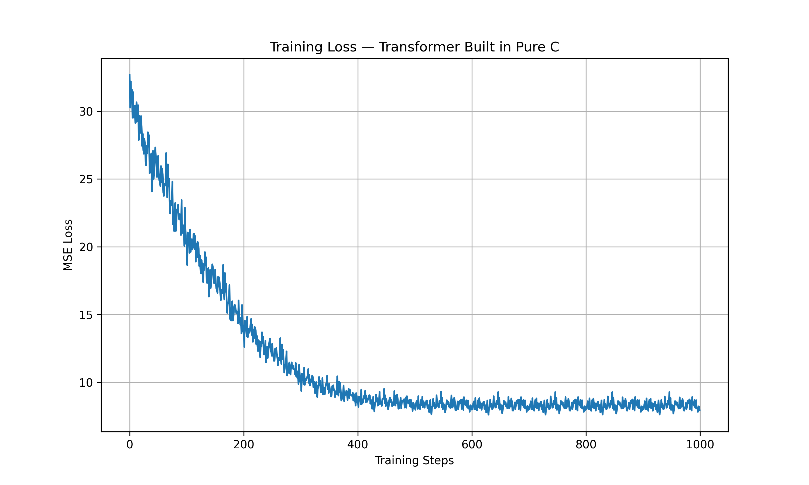

# Traning Loss Curve:

# Transformer From Scratch in C

A **from-scratch implementation of the Transformer architecture in pure C**, built to deeply understand how modern deep learning models work internally.

This project implements the **core components of a Transformer encoder** using only standard C, without relying on any machine learning frameworks such as PyTorch, TensorFlow, or JAX.

The goal is to explore **how attention-based models work at the lowest level**, including tensor operations, memory management, and neural network building blocks.

## Main files:
- tensor.c (All the methods related to Tensor operations)
- attn2.c (All the methods related to multihead attention forward / backward pass)
- ln.c (Layer normalization implementation)
- ffn.c (Methods related to feed forward neural network; forward / backward pass) 
- attention2.h (Attention header file)
- tensor.h (Tensor header file)
- layer_norm.h (Layer norm header file)
- feed_forward_nn.h (feed forward NN header file)
- main.c (main file)

---

## Motivation

Modern ML frameworks abstract away many critical implementation details. While convenient, they often hide how models actually work internally.

This project focuses on **learning by building**.

By implementing Transformers directly in C, we gain insight into:

- How tensors are represented in memory
- How matrix multiplications power neural networks
- How **Self-Attention** operates internally
- How **Multi-Head Attention** splits and combines representations
- How **Layer Normalization** stabilizes training
- How **Feed Forward Networks** transform token embeddings
- How **Transformer Blocks** combine these components together

The project is designed for developers who want to understand **the mechanics behind modern AI architectures** rather than just using high-level libraries.

---

## Transformers Architecture
## Transformer Architecture

---

## Design Goals

- Pure C implementation
- Minimal dependencies
- Educational clarity
- Modular architecture
- Easy experimentation

The code is intentionally written to be **readable and educational**, rather than hyper-optimized.

---

## Why C?

Implementing deep learning architectures in C provides several advantages:

- Full control over **memory layout**
- Better understanding of **tensor operations**
- Insight into **how ML frameworks work internally**
- Strong foundation for building **custom deep learning libraries**

---

## Future Work

Planned improvements include:

- Backpropagation support
- Training loop implementation
- Optimizers (SGD / Adam)
- Positional encoding
- Token embeddings
- Autograd engine
- GPU acceleration (CUDA / Metal)
- Loading pretrained weights
- Full Transformer stack

---

## Educational Purpose

This repository is intended for:

- Engineers learning how Transformers work
- Developers interested in **low-level deep learning systems**
- Students studying neural network architectures
- Researchers exploring minimal ML implementations

---

## References

### Research Paper
- Vaswani et al., 2017 — [Attention Is All You Need](https://arxiv.org/abs/1706.03762)

### Inspirational Implementations
- [nanoGPT](https://github.com/karpathy/nanoGPT)
- [tinygrad](https://github.com/geohot/tinygrad)
- [llama.cpp](https://github.com/ggerganov/llama.cpp) llama.cpp

---

## License

MIT License

---

## Author

**Umair Gillani**
**Email: Umairgillani93@gmail.com**
**Linkedin: https://www.linkedin.com/in/umairgillani93/**

AI Engineer interested in low-level deep learning systems and building machine learning frameworks from scratch.
