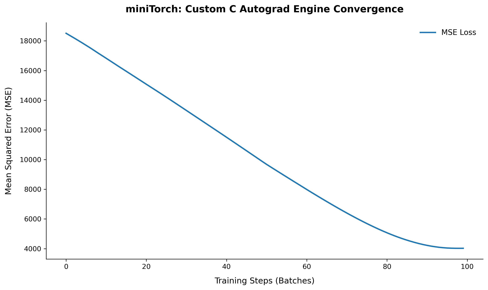

# Transformer & Autograd Engine From Scratch in C

A low-level deep learning framework written entirely in **ISO C**, implementing the core infrastructure required to train Transformer models from first principles.

Unlike educational implementations that rely on high-level frameworks such as PyTorch or TensorFlow, this project rebuilds the underlying mechanics of modern deep learning systems, including a custom tensor library, dynamic computational graph, reverse-mode automatic differentiation, batched training, optimization, and Transformer building blocks.

The objective is not simply to reproduce Transformer layers, but to understand how modern machine learning frameworks operate internally—from raw memory management and tensor operations to gradient propagation and parameter optimization.

---

# Project Highlights

- Pure C implementation (C99)
- Custom Tensor Library
- Dynamic Computational Graph (DAG)
- Reverse-Mode Automatic Differentiation
- Forward & Backward Pass Execution
- Gradient Accumulation
- Batched Training Pipeline
- SGD Optimizer
- Multi-Head Self-Attention
- Layer Normalization
- Feed Forward Network
- Graph Visualization using Graphviz
- Modular Architecture
- Zero dependency on PyTorch, TensorFlow, or other ML frameworks

---

# Training Loss Curve

The framework successfully constructs computational graphs, computes gradients, updates parameters using SGD, and minimizes training loss over multiple iterations.



---

# Computational Graph Execution

During every forward pass, the framework dynamically constructs a **Directed Acyclic Graph (DAG)** representing the sequence of tensor operations.

This graph is later traversed in reverse topological order to perform automatic differentiation and propagate gradients throughout the network.


Each node stores:

- Operation type
- Parent dependencies
- Tensor references
- Gradient buffers
- Backward function pointers

allowing the framework to perform reverse-mode automatic differentiation similar to modern deep learning frameworks.

---

# Architecture

```
                    Input Tensor
                          │
                          ▼
                Computational Graph
                          │
          ┌───────────────┴───────────────┐
          ▼                               ▼
    Forward Execution              Tensor Operations
          │                               │
          └───────────────┬───────────────┘
                          ▼
                     Loss Function
                          │
                          ▼
                 Reverse Topological Sort
                          │
                          ▼
              Automatic Differentiation
                          │
                          ▼
                Gradient Accumulation
                          │
                          ▼
                    SGD Optimizer
                          │
                          ▼
                 Updated Parameters
```

---

# Repository Structure

```
miniTorch/

├── tensor.c
├── tensor.h
├── attn2.c
├── attention2.h
├── ln.c
├── layer_norm.h
├── ffn.c
├── feed_forward_nn.h
├── autograd.c
├── autograd.h
├── optimizer.c
├── optimizer.h
├── main.c
├── run.sh
└── README.md
```

---

# Core Components

### Tensor Library

The project includes a custom tensor implementation supporting:

- Dynamic memory allocation
- Arbitrary tensor dimensions
- Shape metadata
- Strided memory layouts
- Matrix multiplication
- Broadcasting
- Tensor arithmetic
- Memory management

---

### Automatic Differentiation Engine

A complete reverse-mode automatic differentiation engine implemented entirely in C.

Features include:

- Dynamic graph construction
- Reverse topological traversal
- Gradient propagation
- Gradient accumulation
- Operation-specific backward functions
- Memory-safe execution

The framework automatically records every tensor operation during the forward pass and computes gradients during the backward pass without requiring manual derivative calculations.

---

### Multi-Head Self-Attention

Current implementation includes:

- Query projection
- Key projection
- Value projection
- Attention score computation
- Softmax
- Attention weighting
- Output projection
- Backward gradient propagation

---

### Feed Forward Network

Implemented components include:

- Linear Layers
- Activation Functions
- Forward propagation
- Backward propagation

---

### Layer Normalization

Includes:

- Forward normalization
- Learnable scale parameters
- Learnable bias parameters
- Backward gradient computation

---

### Training Pipeline

Current training infrastructure supports:

- Mini-batch training
- Forward propagation
- Loss computation
- Backpropagation
- Gradient updates
- Parameter optimization using SGD

---

# Implemented Features

| Component | Status |
|-----------|--------|
| Custom Tensor Library | ✅ |
| Matrix Multiplication | ✅ |
| Broadcasting | ✅ |
| Tensor Operations | ✅ |
| Dynamic Computational Graph | ✅ |
| Reverse-Mode Autograd | ✅ |
| Gradient Accumulation | ✅ |
| Reverse Topological Traversal | ✅ |
| SGD Optimizer | ✅ |
| Mini-batch Training | ✅ |
| Feed Forward Network | ✅ |
| Layer Normalization | ✅ |
| Multi-Head Self-Attention | ✅ |
| Forward Pass | ✅ |
| Backward Pass | ✅ |
| Loss Minimization | ✅ |

---

# Current Progress

The framework is now capable of:

- Building computational graphs dynamically
- Executing complete forward passes
- Performing automatic differentiation
- Propagating gradients through the graph
- Updating model parameters using SGD
- Training using mini-batches
- Successfully minimizing loss during optimization

The remaining work primarily focuses on completing the full Transformer architecture and improving performance.

---

# Roadmap

## In Progress

- Positional Encoding
- Token Embedding Layer
- Transformer Encoder Block
- Model Checkpoint Serialization

## Planned

- Adam Optimizer
- CUDA Backend
- Metal Backend
- Mixed Precision Training
- Multi-GPU Training
- Transformer Decoder
- GPT-style Architecture
- Loading Pretrained Weights
- Inference Engine
- Performance Optimizations

---

# Motivation

Modern machine learning frameworks provide excellent abstractions but hide many of the engineering details responsible for training large neural networks efficiently.

This project rebuilds those abstractions from scratch to gain a deeper understanding of:

- Tensor memory layouts
- Computational graph execution
- Automatic differentiation
- Reverse-mode backpropagation
- Numerical optimization
- Deep learning systems engineering

The emphasis is on understanding how frameworks such as **PyTorch** work internally rather than treating them as black boxes.

---

# Why C?

Implementing deep learning infrastructure in C provides direct exposure to the engineering challenges hidden beneath modern ML frameworks.

Benefits include:

- Complete control over memory layout
- Manual tensor management
- Efficient numerical computation
- Better understanding of framework internals
- Low-level systems programming experience
- Strong foundation for GPU and compiler development

---

# Getting Started

## Prerequisites

- GCC or Clang (C99 compatible)
- Bash
- Graphviz (optional)

---

## Build

Clone the repository

```bash
git clone https://github.com/umairgillani93/miniTorch.git

cd miniTorch
```

Grant execution permission

```bash
chmod +x run.sh
```

Compile and run

```bash
./run.sh
```

---

# Educational Purpose

This repository is intended for:

- Machine Learning Engineers
- AI Infrastructure Engineers
- Systems Programmers
- Compiler Engineers
- Students studying Deep Learning
- Developers interested in framework internals

---

# References

## Research Paper

Vaswani et al. (2017)

**Attention Is All You Need**

https://arxiv.org/abs/1706.03762

---

## Inspirational Projects

- https://github.com/karpathy/nanoGPT
- https://github.com/geohot/tinygrad
- https://github.com/ggerganov/llama.cpp

---

# Future Vision

The long-term goal is to evolve this repository into a lightweight deep learning framework capable of training Transformer-based language models entirely in C, with support for:

- GPU acceleration
- Distributed training
- Mixed precision
- Model serialization
- Efficient inference
- Decoder-only LLM architectures

---

# License

GNU General Public License v3.0

---

# Author

**Umair Gillani**

AI Engineer | Machine Learning Infrastructure | Deep Learning Systems

📧 Email: Umairgillani93@gmail.com

💼 LinkedIn: https://www.linkedin.com/in/umairgillani93

---

*"The best way to understand modern AI systems is to build them from first principles."*
