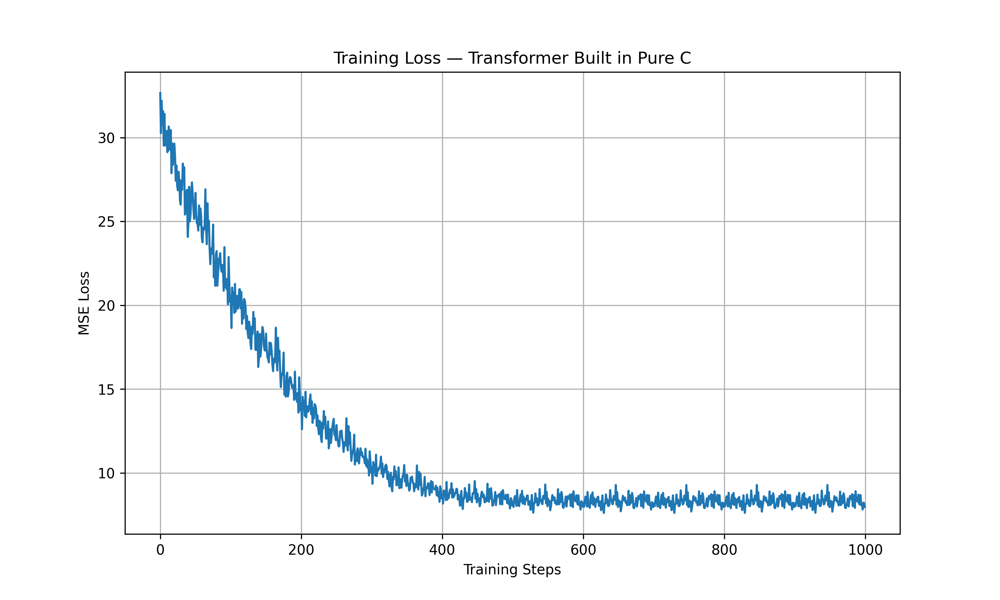

# Transformer & Autograd Engine From Scratch in C

A **from-scratch implementation of the Transformer architecture and a custom Autograd engine in pure C**, built to deeply understand how modern deep learning infrastructure works at the metal.

This project implements the core components of a Transformer encoder alongside a functional **Forward Pass Computational Graph Engine & Backpropagation to update gradients** using only standard C—completely (having custom Tensor library) free of PyTorch, TensorFlow, or high-level frameworks. 

The goal is to explore exactly how attention-based models and automatic differentiation operate at the lowest level, covering raw tensor memory management, strided layouts, explicit DAG tracking, and custom backward passes.

---

# Training Loss Curve
The model successfully tracks gradients, learns, and minimizes loss over training iterations:


---

# 📊 Computational Graph Execution
When running forward passes inside `miniTorch`, the system natively builds and tracks a directed acyclic graph (DAG) of mathematical operations. Below is an execution pass exported directly by the framework via Graphviz:

<!-- Replace this with your actual graph PNG file if named differently -->


*Intermediate nodes capture execution states, maintaining parent-child dependencies directly within our raw memory allocation layers to facilitate topological sorting during backpropagation.*

---

## 🏗️ Core Architecture & File Layout

- `tensor.c` / `tensor.h`: Core tensor primitives, data storage layouts, memory allocation, and strided operations.
- `attn2.c` / `attention2.h`: Multi-Head Attention forward pass logic, shape transformations, and backward pass gradient calculations.
- `ln.c` / `layer_norm.h`: Layer Normalization implementation for training stability.
- `ffn.c` / `feed_forward_nn.h`: Feed-Forward Neural Network blocks (Linear transformations and activations).
- `main.c`: Framework entry point orchestrating tensor initialization, graph building, and model execution.

---

## 🛠️ Current Development Focus: C-Native Autograd
We are actively building out and hardening the **Backward Pass Engine** written purely in C. This expansion moves the project from a forward-only inference engine into a dynamic training framework focusing on:
1. **Topological Sorting:** Evaluating computational graph nodes in reverse topological sequence to guarantee flawless gradient propagation.
2. **Gradient Accumulation:** Ensuring calculated gradient shapes match exact raw tensor tensor dimensions, handling non-contiguous blocks via stride computations.
3. **Memory Arena Optimization:** Consolidating dynamic graph node allocations into flat arenas to eliminate heap fragmentation during execution loops.

---

## 🚀 Getting Started

### Prerequisites
* A C99-compatible compiler (`gcc` or `clang`)
* Bash shell environment
* Graphviz (Optional, for rendering `.png` computation graph pipelines)

### Building and Running
Compilation of all internal modules alongside `main.c` is fully automated via a shell wrapper. Build the project and execute the tensor pipeline in a single command:

```bash
# Clone the repository
git clone [https://github.com/umairgillani93/miniTorch.git](https://github.com/umairgillani93/miniTorch.git)
cd miniTorch

# Ensure script execution permissions
chmod +x run.sh

# Compile modules and execute main engine
./run.sh
```

## Motivation

Modern ML frameworks abstract away many critical implementation details. While convenient, they often hide how models actually work internally.

This project focuses on **learning by building**.

By implementing Transformers directly in C, we gain insight into:

- How tensors are represented in memory
- How matrix multiplications power neural networks
- How **Self-Attention** operates internally
- How **Multi-Head Attention** splits and combines representations
- How **Layer Normalization** stabilizes training
- How **Feed Forward Networks** transform token embeddings
- How **Transformer Blocks** combine these components together

The project is designed for developers who want to understand **the mechanics behind modern AI architectures** rather than just using high-level libraries.

---

## Transformers Architecture
## Transformer Architecture


---

## Design Goals

- Pure C implementation
- Minimal dependencies
- Educational clarity
- Modular architecture
- Easy experimentation

The code is intentionally written to be **readable and educational**, rather than hyper-optimized.

---

## Why C?

Implementing deep learning architectures in C provides several advantages:

- Full control over **memory layout**
- Better understanding of **tensor operations**
- Insight into **how ML frameworks work internally**
- Strong foundation for building **custom deep learning libraries**

---

## Future Work

Planned improvements include:

- Backpropagation support
- Training loop implementation
- Optimizers (SGD / Adam)
- Positional encoding
- Token embeddings
- Autograd engine
- GPU acceleration (CUDA / Metal)
- Loading pretrained weights
- Full Transformer stack

---

## Educational Purpose

This repository is intended for:

- Engineers learning how Transformers work
- Developers interested in **low-level deep learning systems**
- Students studying neural network architectures
- Researchers exploring minimal ML implementations

---

## References

### Research Paper
- Vaswani et al., 2017 — [Attention Is All You Need](https://arxiv.org/abs/1706.03762)

### Inspirational Implementations
- [nanoGPT](https://github.com/karpathy/nanoGPT)
- [tinygrad](https://github.com/geohot/tinygrad)
- [llama.cpp](https://github.com/ggerganov/llama.cpp) llama.cpp

---

## License

MIT License

---

## Author

**Umair Gillani**
**Email: Umairgillani93@gmail.com**
**Linkedin: https://www.linkedin.com/in/umairgillani93/**

AI Engineer interested in low-level deep learning systems and building machine learning frameworks from scratch.

## License
This project is licensed under the GNU GPL v3 License.
